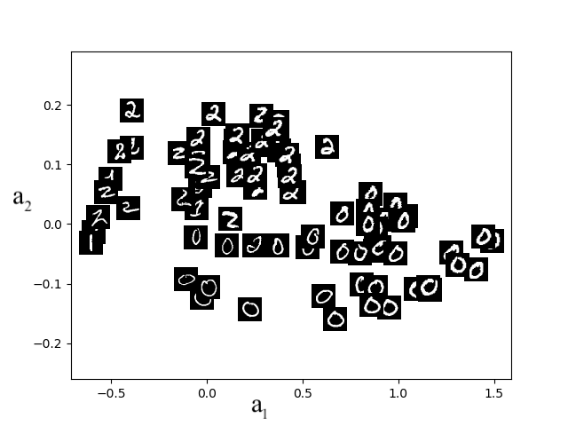

# Representation Learning {#sec-autoencoders}

In previous chapters, we have largely focused on supervised learning, using training samples that have both features/inputs and corresponding labels, to learn models that predict labels for new data. A recurring theme, however, has been the importance of *how data is represented*. In @sec-features, we saw that choosing the right feature transformation can make the difference between a model that works and one that doesn't. In @sec-cnn, we saw that convolutional neural networks learn hierarchical features automatically from data. This chapter steps back to ask a broader question: can we learn good representations of data *directly*, and why would we want to?

:::{.column-margin}
"I stand at the window and see a house, trees, sky. Theoretically I might say there were 327 brightnesses and nuances of colour. Do I have '327'? No. I have sky, house, and trees." --- Max Wertheimer, 1923
:::

## What is a representation? {#sec-what-is-representation}

A *representation* is a mapping from raw data to a more compact, structured encoding that captures the essential information while discarding irrelevant detail. Consider a photograph of some trash cans in front of a fence. A camera records millions of pixel values, but if asked to draw the scene from memory, you would produce something much simpler: a sketch with labels like "wooden fence," "grey trash can," "metal." Your brain has compressed the raw sensory input into a compact description that retains the *meaning* of the scene.

:::{.column-margin}
This example is drawn from experiments by Bartlett (1932) and Intraub & Richardson (1989), who showed that human memory stores scene *gist* rather than pixel-level detail.
:::

More formally, given data $x \in \mathbb{R}^d$, a representation is a function $g: \mathbb{R}^d \rightarrow \mathbb{R}^k$ (typically with $k < d$) that maps the data to a new space where downstream tasks --- classification, clustering, retrieval, generation --- become easier.

What makes a representation *good*? Bengio et al. (2013) identify several desirable properties:

1. **Compact** (*minimal*): the representation uses few dimensions, discarding noise and redundancy.
2. **Explanatory** (*sufficient*): it retains enough information to reconstruct or reason about the original data.
3. **Disentangled**: different dimensions capture independent factors of variation (e.g., digit identity vs. stroke thickness).
4. **Interpretable**: the dimensions correspond to meaningful concepts.
5. **Useful for downstream tasks**: a good representation makes subsequent problem solving easier.

:::{.column-margin}
"Generally speaking, a good representation is one that makes a subsequent learning task easier." --- *Deep Learning*, Goodfellow et al. 2016
:::

These properties are sometimes in tension --- for instance, maximizing compactness may sacrifice explanatory power. However, as we saw with overfitting, maximizing explanatory power for the *current* dataset may actually *lower* it for future datasets. Compact representations help with generalization: just as limiting model complexity prevents overfitting, a bottleneck in the representation forces the model to capture the most broadly useful structure rather than dataset-specific noise. Much of representation learning is about navigating these trade-offs.

## Representations in deep networks {#sec-representations-deep}

We have already seen representation learning at work, even if we didn't call it that. When a CNN is trained to classify images, its internal layers learn a hierarchy of increasingly abstract features.

**Hierarchical feature learning.** We can intuitively understand the types of features learned at different stages by visualizing what individual neurons in a trained CNN respond to. Work by Zeiler and Fergus (2014) showed that early layers learn simple edges and colors, middle layers combine these into textures and object parts, and the deepest layers respond to entire objects and scenes --- mirroring the classical computer vision pipeline, except that here the features are *learned* end-to-end from data rather than hand-designed.

Note that in a CNN trained end-to-end for classification, backpropagation is jointly learning *both* the feature representations (what the filters detect) *and* the fully connected weights (how those features are combined for the final task). The two are coupled: the representations that emerge are shaped by the prediction objective.

**Neuroscience parallels.** This hierarchy shows parallels with what neuroscientists observe in the brain's visual system, which processes information through a series of areas with increasing complexity --- from simple edge detectors in early visual cortex to neurons that respond to whole objects in higher areas. When researchers compare how a deep network and the primate brain each organize visual information, the similarity structures turn out to be closely aligned: images that produce similar neural activation patterns in the brain also produce similar activation patterns in the deep network, and vice versa.

:::{.column-margin}
Yamins et al. (PNAS 2014) compared the similarity structure of deep network activations with neural recordings from primate visual cortex and found a strong correspondence. More recently, [Goldstein et al. (Nature Communications, 2024)](https://doi.org/10.1038/s41467-024-49168-6) showed that brain embeddings and contextual embeddings from language models share common geometric patterns, suggesting that biological and artificial systems converge on similar representational strategies.
:::

**Representations as embeddings.** Each layer of a neural network maps its input to a vector of *activations*. We can think of this activation vector as an *embedding* --- a point in a high-dimensional space where position encodes meaning. It is important to distinguish between the *weights* of a layer and the *activations* it produces: the weights are the learned parameters (the filters in a CNN, the entries of a weight matrix), while the activations are the outputs produced when those weights are applied to a specific input. The embedding of a data point is its activation vector, not the weights themselves --- the weights define the *mapping* between embedding spaces, while the activations are the *representation* of a particular input at a given level of abstraction.

:::{.column-margin}
In a CNN, the learned filters are the "alphabet" or building blocks of the representation. The embedding of a specific image is the vector of filter activations --- how strongly each filter responds at each location. Two images of the same object will produce similar activation patterns even if their pixels differ substantially.
:::

For example, given an image $x$, the activations at some intermediate layer form a vector that represents the image at a particular level of abstraction. We might call this "im2vec" by analogy with "word2vec" (discussed in @sec-embeddings below). If the network has learned a good representation, then semantically similar images will have embeddings that are close together --- two photos of golden retrievers will be nearby in this space, even if the actual pixel values are very different.

## Transfer learning and finetuning {#sec-transfer}

If a deep network's internal representations capture general-purpose features (edges, textures, object parts), then these representations should be useful for tasks *beyond* the one the network was originally trained on. This is the key insight behind *transfer learning*.

**The transfer learning paradigm:**

1. **Pretrain** a network on a large dataset for task A (e.g., classifying 1000 object categories on ImageNet), obtaining learned parameters $W$ and $b$.
2. **Transfer** some or all of these parameters to initialize a new network for task B (e.g., recognizing room types from indoor photographs).
3. **Finetune** the new network on task B's (often much smaller) dataset, resulting in updated parameters $W'$ and $b'$.

:::{.column-margin}
The "learned representation" being transferred is precisely the weights and biases of the pretrained network --- these encode the feature detectors that the network has discovered.
:::

This works because early layers learn general features (edges, textures) that are useful across many visual tasks, while later layers become increasingly task-specific. Finetuning allows the network to adapt its higher-level representations to the new task while preserving the useful lower-level features.

Transfer learning is now standard practice in deep learning. Rather than training from scratch, practitioners typically start from a pretrained model and finetune for their specific application. This dramatically reduces the amount of labeled data needed and often yields better results than training from scratch, even with substantial datasets.

## Learning representations without labels

So far, the representations we discussed (CNN features, transferred representations) were learned through supervised training with labeled data. But labeled data is expensive to acquire --- it requires human annotators to examine each example and assign a label. Meanwhile, *unlabeled* data is abundant: the internet contains billions of images, text documents, and audio recordings, none of which come with labels attached.

Can we learn useful representations from unlabeled data alone? This is the central question of unsupervised and self-supervised representation learning.

### Pretext tasks: from supervised to self-supervised {#sec-self-supervised}

The idea behind *self-supervised learning* is conceptually simple: instead of requiring human-provided labels, we create a supervised learning problem *from the data itself*, using the structure of the data to generate labels automatically.

The key idea is to design a *pretext task* --- an auxiliary prediction problem whose labels are free. By training a network to solve the pretext task, useful representations emerge in its internal layers. This is a natural extension of the supervised learning students are already familiar with --- the only difference is *where the labels come from*.

Examples of pretext tasks include:

- **Masked prediction:** Hide part of the input and train the network to predict the missing piece. For images, this might mean masking random patches and predicting their pixel values. For text, this means masking words and predicting them from context (as in BERT).
- **Context prediction:** Given one part of an input, predict what appears nearby. For example, given one patch of an image, predict which of several candidate patches was its neighbor.
- **Colorization:** Given a grayscale image, predict the colors. To succeed, the network must understand object boundaries, materials, and semantics.

:::{.column-margin}
He et al. (2022) showed that masked autoencoders (MAE) --- which mask 75% of image patches and train the network to reconstruct them --- learn representations that rival or exceed those from supervised pretraining.
:::

In each case, the labels come for free from the data itself --- no human annotation required. The representations that emerge are useful *because* solving these tasks requires understanding the structure of the data. A network that can fill in missing image patches must have learned about textures, object boundaries, and spatial layout. A network that can predict masked words must have learned something about syntax and meaning.

Consider a concrete text example. Given the sentence:

> After the rain, the grass was ____.

A model trained to predict the missing word must learn that "wet" or "green" are likely completions --- which requires understanding something about rain, grass, and their relationship. This is an example of *self-supervision*: the training signal comes from the data itself, not from human labels.

Self-supervised learning has become the dominant paradigm for training large-scale models. Modern language models are trained by predicting the next word in a sequence --- a form of self-supervision that, at scale, produces remarkably capable representations of language.

### Autoencoders: learning representations through compression {#sec-autoencoder-structure}

A special case of self-supervised learning arises when the pretext task is to reconstruct the input $x$ *itself* --- not a masked portion, not a neighboring patch, but the entire input. When this reconstruction is forced through a bottleneck, the result is an *autoencoder*, and the latent representation at the bottleneck becomes very explicit.

In a simple, linearly connected network (without residual connections or separate convolution streams), we can think of the activations at an intermediate layer as the latent representation. The autoencoder makes this idea precise: the network is clamped to produce itself, and the bottleneck forces a compressed encoding that captures the essential structure of the data.

Assume that we have input data $\mathcal{D} = \{x^{(1)}, \ldots,
  x^{(n)} \}$, where $x^{(i)}\in \mathbb{R}^d$. We seek to learn an autoencoder that will produce a new dataset $\mathcal{D}_{out} =
  \{a^{(1)}, \ldots, a^{(n)}\}$, where $a^{(i)}\in \mathbb{R}^k$ with $k
  < d$. We can think about $a^{(i)}$ as the new *representation* of data point $x^{(i)}$. For example, in @fig-illustration we show the learned representations of a dataset of MNIST digits with $k=2$. We see, after inspecting the individual data points, that unsupervised learning has found a compressed (or *latent*) representation where images of the same digit are close to each other, potentially greatly aiding subsequent clustering or classification tasks.

{#fig-illustration width="50%"}

**Structure.** An autoencoder consists of two functions: a vector-valued *encoder* $g : \mathbb{R}^d \rightarrow \mathbb{R}^k$ that maps the data to the representation space $a \in
  \mathbb{R}^k$, and a *decoder* $h : \mathbb{R}^k \rightarrow
  \mathbb{R}^d$ that maps the representation space back into the original data space.

The encoder and decoder are typically neural networks. The basic architecture of a single-layer autoencoder is shown in @fig-autoencoder; note that bias terms $W^1_0$ and $W^2_0$ into the summation nodes exist, but are omitted for clarity in the figure. The original $d$-dimensional input is compressed into $k$ dimensions via the encoder $g(x; W^1, W^1_0)=f_1(W{^1}^T x + W^1_0)$ with $W^1 \in
  \mathbb{R}^{d \times k}$ and $W^1_0 \in \mathbb{R}^k$, where the non-linearity $f_1$ is applied element-wise. To recover (an approximation to) the original instance, we then apply the decoder $h(a; W^2, W^2_0) = f_2(W{^2}^T
  a + W^2_0)$, where $f_2$ denotes a different activation function. In general, both the encoder and decoder could involve multiple layers. Learning seeks parameters $W^1, W^1_0$ and $W^2, W^2_0$ such that the reconstructed instances, $h(g(x^{(i)}; W^{1}, W^1_0); W^{2}, W^2_0)$, are close to the original input $x^{(i)}$.

{#fig-autoencoder width="60%"}

**Learning.** We learn the weights using the same tools from supervised learning: (stochastic) gradient descent to minimize a loss function. The loss $\mathcal{L}(\tilde{x}, x)$ measures the discrepancy between the reconstruction $\tilde{x} = h(g(x; W^{1}, W^1_0); W^{2}, W^2_0)$ and the original input $x$. For continuous-valued $x$, a natural choice is squared loss: $\mathcal{L}_{SE}(\tilde{x}, x) = \sum_{j=1}^{d} (x_j - \tilde{x}_j)^2$.

:::{.column-margin}
Alternatively, you could think of this as *multi-task learning*, where the goal is to predict each dimension of $x$. One can mix-and-match loss functions as appropriate for each dimension's data type.
:::

Learning then seeks to optimize the parameters of $h$ and $g$ so as to minimize the reconstruction error: $$\min_{W^{1}, W^1_0, W^{2}, W^2_0} \sum_{i=1}^n \mathcal{L}_{SE}\left(h(g(x^{(i)}; W^{1}, W^1_0); W^{2}, W^2_0), x^{(i)}\right)$$

**The importance of the bottleneck.** Without further constraints, it is always possible to perfectly reconstruct the input --- for example, by letting $k=d$ and using identity functions. To learn something useful, we must create a *bottleneck* by making $k$ smaller (often much smaller) than $d$. This forces the learning algorithm to discover transformations that describe the original data using as simple a description as possible. For the digits dataset, a compressed representation might capture the digit label (0--9), rotation, and stroke thickness. After learning, we can inspect the learned representations --- for example, by varying one dimension of $a$ and observing how the decoded output $h(a)$ changes --- to understand what the autoencoder has learned.

:::{.study-question-callout}
If we set $k = d$ (the bottleneck has the same dimension as the input), what would the autoencoder learn? Why is the bottleneck essential for learning useful representations?
:::

**Linear encoders and PCA.** Even linear encoders and decoders can be powerful. When both $f_1$ and $f_2$ are the identity function, the optimal solution can be obtained in closed form via *principal components analysis* (PCA) using singular value decomposition (SVD). The neural network autoencoders discussed above can be thought of as nonlinear generalizations of PCA, just as a multilayer neural network for regression generalizes linear regression.

**From compression to downstream tasks.** Once a good encoder has been learned, the decoder can be discarded and the encoder used as a feature extractor. The representations $a = g(x)$ can then be fed into a classifier or regressor trained with supervised learning --- potentially using a much smaller labeled dataset. This connects autoencoders to the semi-supervised learning setting described in @sec-intro_unsupervised: we use a large unlabeled dataset to learn the representation and a small labeled dataset for the downstream task.

### Context-based learning {#sec-context-embeddings}

Another approach to learning representations without labels relies on *co-occurrence*: elements that appear in similar contexts should have similar representations. This is the principle behind *word embeddings* in natural language processing.

Semantically related words such as "dog" and "cat" should have vectors close together, while unrelated words like "cat" and "table" should be farther apart. Similarity between embeddings is frequently measured using the *inner product* (dot product):

$$a^T b = a \cdot b = \sum_{j} a_j \, b_j$$

:::{.column-margin}
A related measure is *cosine similarity*, $\frac{a^T b}{\|a\| \, \|b\|}$, which normalizes for vector magnitude and measures only directional alignment.
:::

The inner product indicates how aligned two vectors are: highly positive values imply strong similarity, negative values indicate opposition, and values near zero suggest no similarity (up to a scaling factor related to the magnitude).

A groundbreaking embedding method, *word2vec* (Mikolov et al., 2013), produced embeddings where vector arithmetic corresponds to semantic relationships:

$$\text{embedding}_{\tt paris} - \text{embedding}_{\tt france} + \text{embedding}_{\tt italy} \approx \text{embedding}_{\tt rome}$$

Such embeddings revealed meaningful semantic relationships like analogies across diverse vocabulary (e.g., *uncle* -- *man* + *woman* $\approx$ *aunt*). The training procedure is a form of self-supervised learning: the network learns to predict a word from its context (or vice versa), and the word vectors that emerge from this training capture distributional semantics --- the principle that "you shall know a word by the company it keeps."

The same context-based principle applies far beyond text:

- **Node2Vec** (Grover and Leskovec, 2016) learns embeddings for nodes in a graph by treating random walks as "sentences" and applying a word2vec-like objective. Nodes that appear in similar graph neighborhoods get similar embeddings.
- **Medical embeddings:** Representations of electronic health records (EHRs) embed patient histories into vector spaces where patients with similar conditions cluster together, enabling better clinical prediction models.
- **Image embeddings:** As discussed in @sec-representations-deep, intermediate layers of CNNs produce embeddings where visually and semantically similar images are nearby.

### Contrastive and multimodal learning (optional) {#sec-contrastive}

The methods above --- self-supervised pretext tasks, autoencoders, and context-based learning --- learn representations by predicting, reconstructing, or co-locating data. *Contrastive learning* takes a different approach: rather than reconstructing or predicting parts of the input, it learns by *comparing* examples, directly shaping the geometry of the representation space.

The core idea is simple:

1. Take a data point and create two augmented versions of it (e.g., two different crops/color shifts of the same image). These form a *positive pair*.
2. Other data points in the batch form *negative pairs*.
3. Train the network to produce representations where positive pairs are close together and negative pairs are far apart.

This encourages the network to learn representations that are *invariant* to the augmentations (cropping, color changes, etc.) while still distinguishing different inputs. Frameworks like SimCLR and MoCo have shown that contrastive learning can produce representations competitive with supervised pretraining.

:::{.column-margin}
He et al. (2020) introduced MoCo (Momentum Contrast), which maintains a dynamic queue of negative examples, enabling contrastive learning to scale effectively.
:::

**Multimodal learning.** The contrastive principle extends naturally to learning shared representations across different data types --- for instance, images and their text descriptions, or audio and video. The intuition is that different modalities provide complementary views of the same underlying concept. A photo of a dog and the sentence "a golden retriever playing fetch" both refer to the same scene. By training a model to pull together representations of matching image-text pairs (positives) while pushing apart mismatched pairs (negatives), we obtain a shared embedding space where related concepts from different modalities are close together, regardless of their original form.

This idea underlies models like CLIP, which learns a joint embedding space for images and text. Given an image, CLIP can retrieve relevant text descriptions, and vice versa --- all without being explicitly trained on any specific classification task. The shared representation enables flexible "zero-shot" transfer to new tasks simply by describing them in natural language.

:::{.column-margin}
LeCun (2022) argues that learning representations that integrate multiple modalities and enable prediction at multiple time scales is a key step toward more autonomous machine intelligence.
:::

## Embeddings: a unifying view {#sec-embeddings}

The representations learned by all the methods above are, at their core, *embeddings*: mappings from complex, high-dimensional data (images, words, sentences, graphs) into vectors in a lower-dimensional space. The key property of a good embedding is that **geometric relationships in the vector space reflect meaningful relationships in the original data**.

:::{.column-margin}
Importantly, embeddings don't need exact coordinates --- it's their *relative positioning* within the vector space that matters.
:::

A striking theme across all these methods is that *semantic meaning emerges from structural regularities in the data, not from labels*. An autoencoder trained on digit images, with no knowledge of digit labels, learns a latent space where images of the same digit cluster together. A language model trained to predict the next word, with no explicit grammar instruction, learns syntactic and semantic structure. A contrastive model trained with only image augmentations learns to distinguish object categories it was never told about. Why? Because *the factors that explain the structure of the data are often the same factors that are semantically meaningful*. The learning algorithms discover these factors not because they are told to, but because doing so is the most efficient way to solve their training objectives. This also helps explain why some pretext tasks work better than others: tasks that require understanding *meaning* (predicting masked words, reconstructing missing image regions) tend to produce better representations than tasks solvable by surface-level shortcuts.

Despite the diversity of methods, they all share a common goal: imposing constraints that reveal latent structure. The differences lie in *what constraint* is used:

| Paradigm | Core constraint | Examples |
|----------|----------------|----------|
| **Prediction** | Predict missing or future data | Masked language models, colorization, next-word prediction (@sec-self-supervised) |
| **Compression** | Reconstruct through a bottleneck | Autoencoders, PCA (@sec-autoencoder-structure) |
| **Context** | Co-occurring elements should map nearby | Word2Vec, Node2Vec (@sec-context-embeddings) |
| **Contrast** | Same input under different views should align | SimCLR, CLIP (@sec-contrastive) |
| **Proximity** | Nearby points in data space should stay nearby | t-SNE, UMAP |

: Five paradigms for learning representations. Each imposes a different constraint, but all produce embeddings where geometry encodes meaning. {#tbl-paradigms}

These paradigms differ in the strength of their constraints. Proximity-based methods like t-SNE reveal that structure *exists* by preserving neighborhood relationships, but the resulting embeddings are typically not reusable for new data points. Compression forces the model to retain essential information. Prediction and context require inferring missing semantics. Contrastive learning imposes the strongest constraint, explicitly sculpting the geometry of the embedding space by pulling similar items together and pushing dissimilar items apart.

### Ethics of embeddings

Embeddings capture relationships present in their training data --- including human biases. Word embeddings trained on internet text have been shown to encode gender stereotypes (e.g., "woman" clusters closer to "nurse" while "man" clusters closer to "doctor") and other societal biases. Since embeddings form the foundation of many downstream applications, these biases can propagate into real-world decisions.

Detecting and mitigating bias in learned representations is an active area of research, raising important questions about fairness, accountability, and the social impact of representation learning.

### Connection to transformers

The idea of embeddings plays a central role in the transformer architecture discussed in @sec-transformers, where word embeddings are dynamically adjusted based on context via the *attention mechanism*. A word like "bank" receives different embeddings depending on whether the surrounding context is about finance or rivers --- enabling a more nuanced understanding of language than static embeddings like word2vec can provide.
