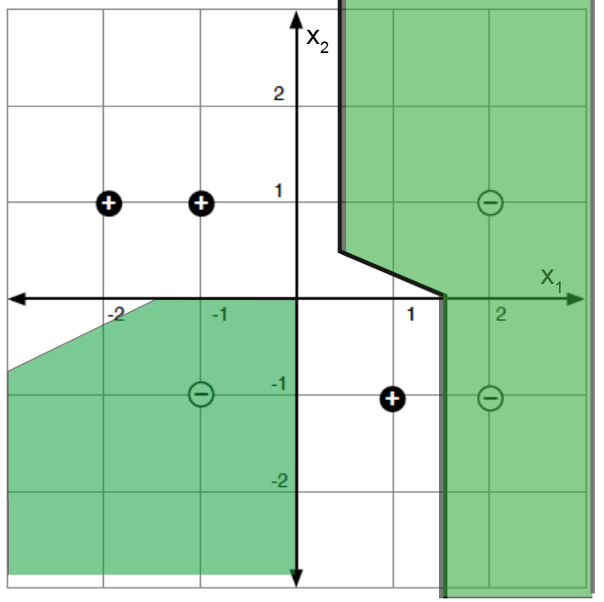
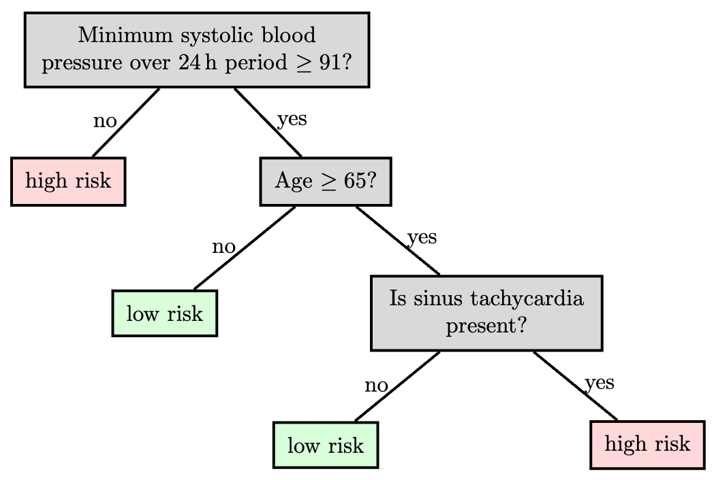
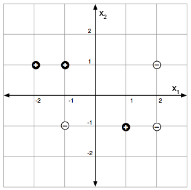
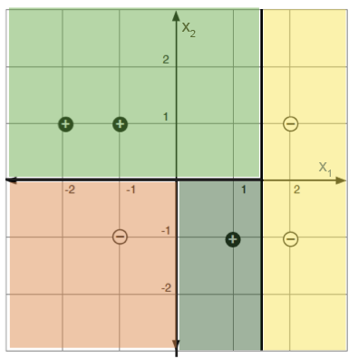
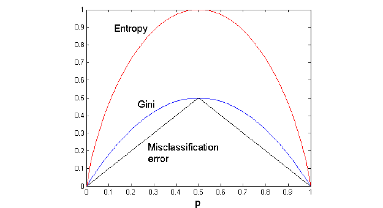
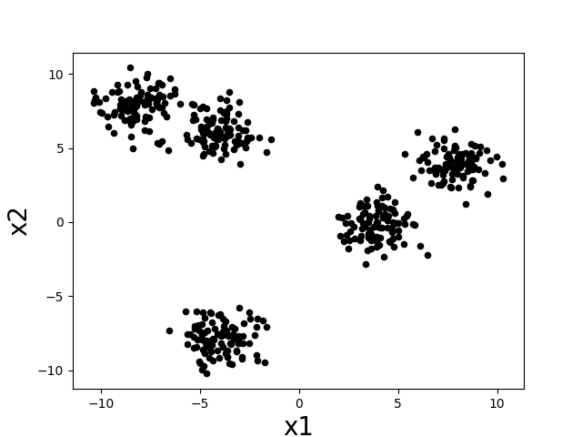
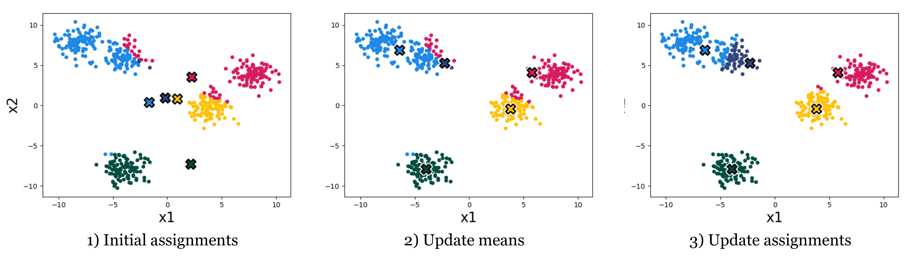
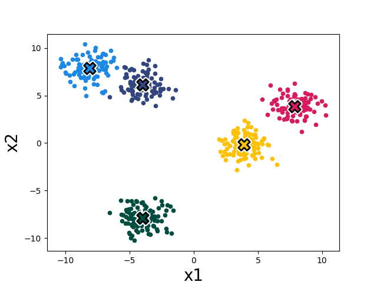
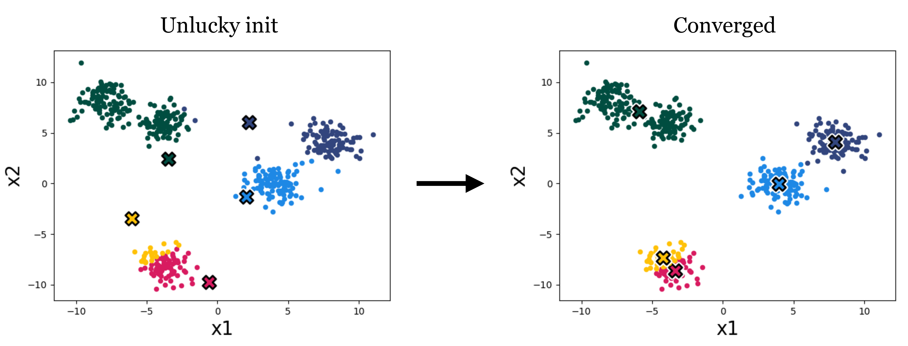
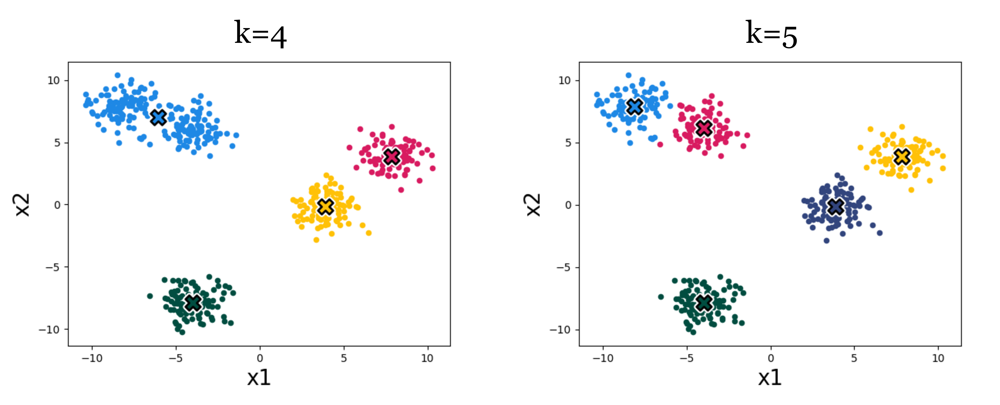

# Non-parametric Models {#sec-nonparametric}

Neural networks have adaptable complexity in the sense that we can try different architectures and use cross-validation to pick one that works well on our data. In this chapter we turn to models that adapt their complexity *automatically* to the training data: the name *non-parametric* is misleading: these methods do have parameters, but the size of the parameterization can grow as we acquire more data, rather than being fixed in advance.

The methods we consider here tend to have the form of a composition of simple models:

-   *Nearest neighbor models*: @sec-np_nn where we don't process data at training time, but do all the work when making predictions, by looking for the closest training example(s) to a given new data point.

-   *Tree models*: @sec-np_trees where we partition the input space and use different simple predictions on different regions of the space; the hypothesis space can become arbitrarily large allowing finer and finer partitions of the input space.

-   *Ensemble methods*: @sec-ensembles in which we train several base learners and combine their outputs; this decreases the estimation error. We focus on *bagging* and *random forests* applied to trees.

-   *$k$-means clustering methods*: @sec-clustering where we partition data into groups based on similarity without predefined labels, adapting complexity by adjusting the number of clusters.

Even in the era of large neural networks, these methods are worth knowing: they are fast, have few hyperparameters, often perform competitively, and can be more interpretable (decision trees are directly readable; nearest neighbors can point to the training examples behind a prediction).

## Nearest Neighbor {#sec-np_nn}

In nearest-neighbor models, we don't do any processing of the data at training time -- we just remember it! All the work is done at prediction time.

Input values $x$ can be from any domain $\mathcal X$ ($\mathbb{R}^d$, documents, tree-structured objects, etc.). We just need a distance metric, $d: \mathcal X \times \mathcal X
  \rightarrow \mathbb{R}^+$, which satisfies the following, for all $x, x', x'' \in
  \mathcal X$: $$\begin{aligned}
  d(x, x)   & = 0                        \\
  d(x, x')  & = d(x', x)                 \\
  d(x, x'') & \leq d(x, x') + d(x', x'')
\end{aligned}$$

Given a dataset $\mathcal{D}= \{(x^{(i)},y^{(i)})\}_{i=1}^n$, our predictor for a new query $x \in \mathcal X$ is $$h(x) = y^{(i^*)} \quad \text{where} \quad i^* = \arg\min_i d(x, x^{(i)}),$$ with ties broken at random.

This same algorithm works for regression *and* classification!

Geometrically, this partitions the input space into a *Voronoi diagram*: one region per training point, with the prediction in each region being that point's $y$ value.

{width="40%" fig-align="center"}

There are several useful variations on this method. In *$k$-nearest-neighbors*, we find the $k$ training points nearest to the query point $x$ and output the majority $y$ value for classification or the average for regression. We can also do *locally weighted regression* in which we fit locally linear regression models to the $k$ nearest points, possibly giving less weight to those that are farther away. In large data-sets, it is important to use good data structures (e.g., ball trees) to perform the nearest-neighbor look-ups efficiently (without looking at all the data points each time).

## Tree Models {#sec-np_trees}

The idea here is that we would like to find a partition of the input space and then fit very simple models to predict the output in each piece. The partition is described using a (typically binary) "tree" that recursively splits the space.

Tree methods differ in their split family (often axis-aligned), the predictors used in the leaves (often constants), how they control complexity, and the fitting algorithm.

A key advantage of trees is interpretability: a human can follow the decisions a tree makes. This matters in domains like medicine, where experts need to trust algorithmic recommendations. Trees work best when features carry useful information individually or in small groups (e.g., a set of clinical measurements of a patient); they're less suitable for high-dimensional inputs like raw images.

:::{.callout-note}
# Example

Here is a sample tree (reproduced from Breiman, Friedman, Olshen, Stone (1984)):

{width="70%"}

:::

We'll concentrate on CART and ID3: they greedily build a partition with *axis-aligned* splits and a *constant* model in each leaf. The interesting questions are how to choose the splits and how to control complexity; regression and classification versions are very similar.

:::{.column-margin}
CART ("classification and regression trees") and ID3 ("iterative dichotomizer 3") were invented independently in the statistics and AI communities.
:::

For a concrete example: labeled points in a 2-D feature space (left) and a decision-tree partition that classifies them perfectly (right).

{width="45%"} {width="43.5%"}

### Regression

The predictor is made up of

-   a partition function, $\pi$, mapping elements of the input space into exactly one of $M$ regions, $R_1, \ldots, R_M$, and

-   a collection of $M$ output values, $O_m$, one for each region.

Let $I = \{1, \ldots, n\}$ index the training set, and let $I_m = \{i \in I \mid x^{(i)} \in R_m\}$ collect the indices in region $R_m$. Given a partition, the natural choice for the constant output is the per-region average:
$$O_m = \text{average}_{i \in I_m}\, y^{(i)}.$$
The natural per-region error is the sum of squared errors:
$$E_m = \sum_{i \in I_m}(y^{(i)} - O_m)^2.$$
Ideally we'd choose the partition to minimize
$$\lambda M + \sum_{m=1}^M E_m,$$
where $\lambda$ regularizes against having too many regions.

:::{.column-margin}
It suffices to search over partitions of the *training data* (not the whole input space), but even that problem is NP-complete; hence the greedy approach below.
:::

#### Building a tree

So we'll be greedy: pick the best single split by some criterion, then recurse. For now we pick the split that minimizes the total sum-of-squared-errors across the two children; we'll consider other criteria later.

In the pseudocode below, `BuildTree` operates on a subset $I$ of the training indices (so the recursive calls work on the children of each split). For a candidate split at dimension $j$ and value $s$, we write $I^+_{j,s}$ and $I^-_{j,s}$ for the two children, and $\hat{y}^\pm_{j,s}$ for their average $y$ values. The hyperparameter $k$ is the largest leaf size we'll allow.


```pseudocode
#| html-indent-size: "1.2em"
#| html-comment-delimiter: "//"
#| html-line-number: true
#| html-line-number-punc: ":"
#| html-no-end: false
#| pdf-placement: "htb!"
#| pdf-line-number: true
#| label: buildtree
\begin{algorithm}
\begin{algorithmic}[1]
\Procedure{BuildTree}{$I, k$}
  \If{$|I| \leq k$}
    \State $\hat{y} \gets \frac{1}{|I|}\sum_{i \in I} y^{(i)}$
    \Return $\text{Leaf}(\text{value} = \hat{y})$
  \Else
    \ForAll{split dimension $j$, split value $s$}
      \State $I^+_{j,s} \gets \{i \in I \mid x_j^{(i)} \geq s\}$
      \State $I^-_{j,s} \gets \{i \in I \mid x_j^{(i)} < s\}$
      \State $\hat{y}^+_{j,s} \gets \frac{1}{|I^+_{j,s}|}\sum_{i \in I^+_{j,s}} y^{(i)}$
      \State $\hat{y}^-_{j,s} \gets \frac{1}{|I^-_{j,s}|}\sum_{i \in I^-_{j,s}} y^{(i)}$
      \State $E_{j,s} \gets \sum_{i \in I^+_{j,s}} (y^{(i)} - \hat{y}^+_{j,s})^2 \; + \; \sum_{i \in I^-_{j,s}} (y^{(i)} - \hat{y}^-_{j,s})^2$
    \EndFor
    \State $(j^*, s^*) \gets \arg\min_{j,s} E_{j,s}$
    \State \Return $\text{Node}\bigl(j^*, s^*, \text{BuildTree}(I^-_{j^*,s^*}, k), \text{BuildTree}(I^+_{j^*,s^*}, k)\bigr)$
  \EndIf
\EndProcedure
\end{algorithmic}
\end{algorithm}
```


In practice, we call `BuildTree` initially with $I = \{1,\ldots,n\}$ (the whole training set), and the recursion does the rest.

Each call considers $O(dn)$ splits: $d$ feature dimensions, with $O(n)$ candidate split points per dimension (only the gaps between consecutive sorted data points matter; any other split gives the same training error).

### Classification

The strategy for building and pruning classification trees is very similar to that for regression. We reuse the same partition machinery: regions $R_m$ with index sets $I_m$, region predictor $O_m$, and region error $E_m$. Only the definitions of $O_m$ and $E_m$ change.

The natural region predictor is the *majority class* among the training points in $R_m$:
$$O_m = \text{majority}_{i \in I_m}\, y^{(i)},$$
and the natural region error is the count of misclassified points:
$$E_m = \bigl|\{i \in I_m \mid y^{(i)} \neq O_m\}\bigr|.$$
We will also need the *empirical class probability* in region $m$:
$$\hat{P}_{m,k} = \frac{\bigl|\{i \in I_m \mid y^{(i)} = k\}\bigr|}{N_m}, \qquad N_m = |I_m|.$$
For splits, $\hat{P}_{m,j,s}$ denotes the fraction of points in region $m$ falling into one branch of the split $(j, s)$, and $1 - \hat{P}_{m,j,s}$ the other.

#### Splitting criteria {#splitting-criteria}

The greedy algorithm needs a way to decide which split to make next; we measure the "impurity" of a child node and pick the split that decreases impurity most. We use *entropy*:
$$Q_m(T) = H(I_m) = -\sum_k \hat{P}_{m,k}\log_2 \hat{P}_{m,k},$$
with the convention $0\log_2 0 = 0$ so $H$ is well-defined when $\hat{P} = 0$.

:::{.callout-note collapse="true"}
# Other impurity measures
Two other common choices are *misclassification error* $1 - \hat{P}_{m,O_m}$ and the *Gini index* $\sum_k \hat{P}_{m,k}(1 - \hat{P}_{m,k})$. All three vanish on pure regions ($\hat{P}_{m,0} \in \{0, 1\}$) and peak near $\hat{P}_{m,0} = 0.5$, as the impurity curves below show (with $p = \hat{P}_{m,0}$). Tradition uses entropy when growing the tree and misclassification error when pruning.

{width="60%" fig-align="center"}
:::

Analogous to regression (where we picked the split minimizing the sum of squared errors $E_{j,s}$), here we pick the split minimizing the weighted-average entropy of the two children:
$$\hat{H} = \frac{|I^-_{j,s}|}{N_m}\, H(I^-_{j,s}) + \frac{|I^+_{j,s}|}{N_m}\, H(I^+_{j,s}).$$
This is equivalent to maximizing the *information gain* of the test $x_j = s$:
$$\text{infoGain}(x_j = s, I_m) = H(I_m) - \hat{H}.$$

### Pruning

Pruning applies to both regression and classification trees: in either case, naive early-stopping criteria can miss splits that are valuable only after a further split, so we grow a large tree and prune it back.

We define the *cost complexity* of a tree $T$ (with leaves indexed by $m$) as
$$C_\alpha(T) = \sum_{m=1}^{|T|} E_m(T) + \alpha |T|,$$
where $|T|$ is the number of leaves and $E_m$ is whichever per-region error matches the task (sum of squared errors for regression, misclassification count for classification). For a fixed $\alpha$, "weakest-link" pruning approximately minimizes $C_\alpha(T)$:

-   Create a sequence of trees by successively removing the bottom-level split that minimizes the increase in overall error, until the root is reached.

-   Return the tree in this sequence that minimizes $C_\alpha$.

We pick $\alpha$ by cross-validation.

### Tree variants and tradeoffs

There are many variations on the tree theme. One is to employ different regression or classification methods in each leaf. For example, a linear regression might be used to model the examples in each leaf, rather than using a constant value.

In the relatively simple trees that we've considered, splits have been based on only a single feature at a time, and with the resulting splits being axis-parallel. Other methods for splitting are possible, including consideration of multiple features and linear classifiers based on those, potentially resulting in non-axis-parallel splits. Complexity is a concern in such cases, as many possible combinations of features may need to be considered, to select the best variable combination (rather than a single split variable).

Another generalization is a *hierarchical mixture of experts*, where we make a "soft" version of trees, in which the splits are probabilistic (so every point has some degree of membership in every leaf). Such trees can be trained using a form of gradient descent. Combinations of bagging, boosting, and mixture tree approaches (e.g., *gradient boosted trees*) and implementations are readily available (e.g., XGBoost).

Trees remain a valuable tool: they are interpretable, fast to train, handle multi-class targets and varied loss functions naturally, and expose feature importance. They also perform surprisingly well in practice; random forests and boosted trees are often used as a baseline against which to evaluate more sophisticated models.

## Ensemble methods {#sec-ensembles}

A single tree can have high estimation error: small changes in the data can produce very different trees. *Ensemble methods* combat this by training many predictors and combining their outputs. The techniques we cover here, *bagging* and *random forests*, are framework-level ideas that apply to any base learner, but they are most commonly paired with trees, both because trees are high-variance (so averaging helps) and because tree training is cheap.

### Bagging {#sec-np_bagging}

*Bootstrap aggregation* (bagging) reduces the estimation error of an adaptive predictor by training it on different bootstrap samples of the data and averaging the results.

-   Construct $B$ new data sets of size $n$. Each data set is constructed by sampling $n$ data points with replacement from $\mathcal{D}$. A single data set is called a *bootstrap sample* of $\mathcal{D}$.

-   Train a predictor $\hat{f}^b(x)$ on each bootstrap sample. When the base learner is a tree, the standard tree-building algorithm is used, which considers *all* features when deciding how to split at each node.

-   *Regression case*: bagged predictor is $$\hat{f}_{\text{bag}}(x) = \frac{1}{B} \sum_{b=1}^B \hat{f}^b(x) \; .$$

-   *Classification case* (with $K$ classes): represent each tree's vote as a one-hot vector $\hat{f}^b(x) \in \{0,1\}^K$, and average to get the proportion that predicted each class:
    $$\hat{f}_{\text{bag}}(x) = \frac{1}{B} \sum_{b=1}^B \hat{f}^b(x).$$
    The bagged prediction is the majority vote: $\hat{y}_{\text{bag}}(x) = \arg\max_k \hat{f}_{\text{bag}}(x)_k$.

Bagging does come at a cost: any simple interpretability of the base model is lost.

### Random Forests

Random forests extend bagging with one extra source of randomness: at each split node, instead of considering all $d$ features to find the best split, the algorithm picks $m$ features at random ($m \leq d$ is a hyperparameter) and chooses the best split among those. This *random feature selection* further de-correlates the trees, sharpening the gain from voting. In practice, random forests often perform extremely well, even against much fancier methods.

In what follows, $B$, $m$, and $n$ are hyperparameters of the algorithm.

```pseudocode
#| html-indent-size: "1.2em"
#| html-comment-delimiter: "//"
#| html-line-number: true
#| html-line-number-punc: ":"
#| html-no-end: false
#| pdf-placement: "htb!"
#| pdf-line-number: true
\begin{algorithm}
  \begin{algorithmic}[1]
    \Procedure{RandomForest}{$B, m, n$}
      \For{$b = 1$ \textbf{to} $B$}
        \State Draw a bootstrap sample $\mathcal{D}_b$ of size $n$ from $\mathcal{D}$
        \State Grow tree $T_b$ on $\mathcal{D}_b$:
        \While{there are splittable nodes}
          \State Select $m$ variables at random from the $d$ total variables
          \State Pick the best variable and split point among those $m$
          \State Split the current node
        \EndWhile
      \EndFor
      \State \Return $\{T_b\}_{b=1}^B$
    \EndProcedure
  \end{algorithmic}
\end{algorithm}
```

All the methods so far in this chapter (nearest neighbors, trees, and tree ensembles) are *supervised*: they learn from labeled examples. We now turn to *k-means clustering*, an unsupervised non-parametric method: instead of mimicking a labeled mapping, it discovers groupings in unlabeled data based on similarity.

## $k$-means Clustering {#sec-clustering}
*Clustering* is the problem of automatically discovering meaningful groupings in a dataset, without pre-assigned labels. A doctor may notice that their patients come in cohorts that respond differently to different treatments; a biologist may identify that bats and whales, despite outward appearances, both belong to the same category ("mammal"). Once such groupings are found, they can be used to interpret the data and to make decisions per group.

### Clustering formalisms

Mathematically, clustering resembles classification (we want a mapping from datapoints $x$ to categories $y$), except the categories are not predefined. Instead, they are *partitions* of an unlabeled dataset $\{x^{(i)}\}_{i=1}^n$, discovered from how the data is *distributed* in input space. This makes clustering an *unsupervised* learning problem.

Intuitively, a "cluster" is a group of datapoints that are all nearby to each other and far away from other clusters. Let's consider the following scatter plot. How many clusters do you think there are?

{#fig-kmeans_fig1 width="40%"}

There seem to be about five clumps of datapoints and those clumps are what we would like to call clusters. If we assign all datapoints in each clump to a cluster corresponding to that clump, then we might desire that nearby datapoints are assigned to the same cluster, while far apart datapoints are assigned to different clusters.

In designing clustering algorithms, three critical things we need to decide are:

-   How do we measure *distance* between datapoints? What counts as "nearby" and "far apart"?

-   How many clusters should we look for?

-   How do we evaluate how good a clustering is?

We will see how to begin making these decisions as we work through a concrete clustering algorithm in the next section.

### Loss and algorithm

*k-means* is one of the simplest clustering algorithms. It picks cluster assignments $y^{(i)} \in \{1, \ldots, k\}$ to minimize the total within-cluster variance:

$$\sum_{j=1}^k \sum_{i=1}^n \mathbb{1}(y^{(i)} = j) \lVert x^{(i)} - \mu^{(j)} \rVert^2,
$${#eq-kmeans_obj}

where $\mu^{(j)} = \frac{1}{N_j} \sum_{i=1}^n \mathbb{1}(y^{(i)} = j) x^{(i)}$ is the mean of cluster $j$, $N_j = \sum_i \mathbb{1}(y^{(i)} = j)$ is its size, and $\mathbb{1}(\cdot)$ is the indicator function. Each inner sum is one cluster's within-cluster variance; the outer sum totals these across all $k$ clusters.

The k-means algorithm minimizes this loss by alternating two steps: (1) reassign each datapoint to the cluster with the nearest mean, and (2) recompute each cluster mean from the points now assigned to it. Both steps are non-increasing in the loss, so the algorithm converges. @fig-kmeans_iters shows the first three iterations on our toy dataset; @fig-kmeans_converged shows the converged result after four iterations.

{#fig-kmeans_iters width="100%"}

{#fig-kmeans_converged width="40%"}

In full detail:

```pseudocode
#| html-indent-size: "1.2em"
#| html-comment-delimiter: "//"
#| html-line-number: true
#| html-line-number-punc: ":"
#| html-no-end: false
#| pdf-placement: "htb!"
#| pdf-line-number: true
\begin{algorithm}
  \begin{algorithmic}[1]
    \Procedure{KMeans}{$k, \tau, \{x^{(i)}\}_{i=1}^n$}
      \State Initialize centroids $\mu^{(1)},\dots,\mu^{(k)}$ and assignments $y^{(1)},\dots,y^{(n)}$ randomly
      \For{$t = 1$ \textbf{to} $\tau$}
        \State $y_{\mathrm{old}} \gets y$
        \For{$i = 1$ \textbf{to} $n$}
          \State $y^{(i)} \gets \arg\min_{j\in\{1,\dots,k\}} \bigl\lVert x^{(i)} - \mu^{(j)}\bigr\rVert^2$
        \EndFor
        \For{$j = 1$ \textbf{to} $k$}
          \State $N_j \gets \sum_{i=1}^n \mathbb{1}\bigl(y^{(i)}=j\bigr)$
          \State $\mu^{(j)} \gets \frac{1}{N_j}\sum_{i=1}^n \mathbb{1}\bigl(y^{(i)}=j\bigr)\,x^{(i)}$
        \EndFor
        \If{$y = y_{\mathrm{old}}$}
          \State \textbf{break} \Comment{convergence}
        \EndIf
      \EndFor
      \State \Return $\mu, y$
    \EndProcedure
  \end{algorithmic}
\end{algorithm}
```

#### Using gradient descent to minimize the k-means objective

We can also use gradient descent. Rewrite the objective as a differentiable function of $\mu$ alone, by choosing the optimal assignment for each point on the fly:
$$L(\mu) = \sum_{i=1}^n \min_j \lVert x^{(i)} - \mu^{(j)} \rVert^2.$$
Run gradient descent on $L(\mu)$, then read off the cluster assignments from the optimized $\mu$:
$$y^{(i)} = \arg\min_j \lVert x^{(i)} - \mu^{(j)} \rVert^2.$$
This converges to a local minimum of @eq-kmeans_obj, just like the alternating algorithm; it isn't guaranteed to find the global minimum because $L$ is non-convex.

### Practical considerations

#### Importance of initialization

Both variants only converge to a local minimum, so the result depends on the initialization of the cluster means. @fig-kmeans_init shows a different initialization on our toy data leading to a worse clustering:

{#fig-kmeans_init width="80%"}

A variety of methods have been developed to pick good initializations (see, for example, the *k-means++* algorithm). One simple option is to run the standard k-means algorithm multiple times, with different random initial conditions, and then pick from these the clustering that achieves the lowest k-means loss.

#### Importance of k {#sec-importance_of_k}

The number of clusters $k$ is a hyperparameter we have to pick (some advanced algorithms can infer it automatically, but k-means is not one of them).

{#fig-effect_of_k width="67%"}

@fig-effect_of_k shows an example of the effect. Which result looks more correct? It can be hard to say! Using higher k we get more clusters, and with more clusters we can achieve lower within-cluster variance -- the k-means objective will never increase, and will typically strictly decrease as we increase k. Eventually, we can increase k to equal the total number of datapoints, so that each datapoint is assigned to its own cluster. Then the k-means objective is zero, but the clustering reveals nothing. Clearly, then, we cannot use the k-means objective itself to choose the best value for k. In @sec-eval, we will discuss some ways of evaluating the success of clustering beyond its ability to minimize the k-means objective, and it's with these sorts of methods that we might decide on a proper value of k.

:::{.column-margin}
*Hierarchical clustering* sidesteps picking a single $k$ by producing a tree of clusterings at multiple granularities (coarse near the root, fine near the leaves), useful for discovering taxonomies (e.g., species, families, kingdoms). See SKLEARN's [cluster](https://scikit-learn.org/1.5/modules/clustering.html) module for many other clustering algorithms.
:::

#### k-means in feature space

Clustering algorithms group data based on a notion of *similarity*, and thus we need to define a *distance metric* between datapoints. This notion will also be useful in other machine learning approaches, such as nearest-neighbor methods that we see in @sec-np_nn. In k-means and other methods, our choice of distance metric can have a big impact on the results we will find.

Our k-means algorithm uses the Euclidean distance, i.e., $\lVert x^{(i)} - \mu^{(j)} \rVert$, with a loss function that is the square of this distance. We can modify k-means to use different distance metrics, but a more common trick is to stick with Euclidean distance but measured in a *feature space*. Just like we did for regression and classification problems, we can define a feature map from the data to a nicer feature representation, $\phi(x)$, and then apply k-means to cluster the data in the feature space.

As a simple example, suppose we have two-dimensional data that is very stretched out in the first dimension and has less dynamic range in the second dimension. Then we may want to scale the dimensions so that each has similar dynamic range, prior to clustering. We could use standardization, like we did in @sec-features.

If we want to cluster more complex data, like images, music, chemical compounds, etc., then we will usually need more sophisticated feature representations. One common practice these days is to use feature representations learned with a neural network. For example, we can use an autoencoder to compress images into feature vectors, then cluster those feature vectors.

### How to evaluate clustering algorithms {#sec-eval}

Evaluation is hard for clustering, and for unsupervised methods in general, because there are no target values to predict. The k-means loss alone is not enough: as in @sec-importance_of_k, taking $k$ very large drives the loss to zero without yielding any insight. A few practical alternatives:

-   **Consistency** across subsamples or hyperparameter choices (e.g., random initializations). If bootstrapped runs produce very different clusters, the result is fragile.
-   **Ground truth**: if a few points are known to belong together, check whether they end up in the same discovered cluster.
-   **Downstream task success**: if the clusters feed into a downstream model (e.g., one regression fit per cluster, as in @fig-simpsons_color), measure success on that downstream task.

Clustering is also frequently used for **visualization** and **interpretability**, where human judgment guides the choice of algorithm and validates the result.

{#fig-simpsons_color width="35%"}

## Summary

The methods in this chapter all share one trait: their complexity grows with the data, rather than being fixed by an architecture chosen up front. *Nearest neighbors* defers all the work to query time; *trees* recursively partition the input space and fit a simple predictor in each region; *ensembles* (bagging and random forests) average many trees to drive down variance; and *k-means* brings the partitioning idea to the unsupervised setting, discovering groupings without labels. None of these require the kind of architectural search that neural networks do, and yet all of them are competitive baselines worth reaching for first.